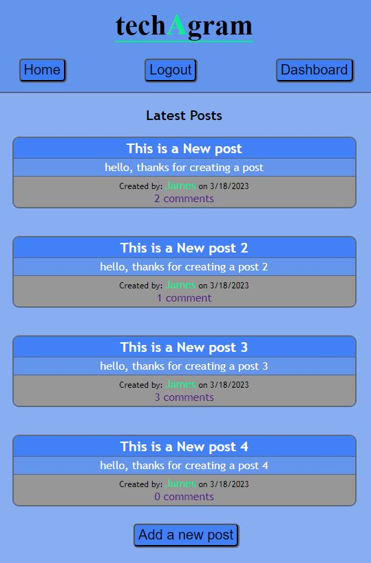
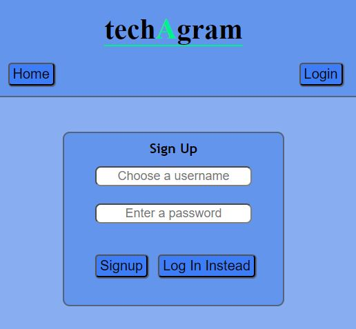
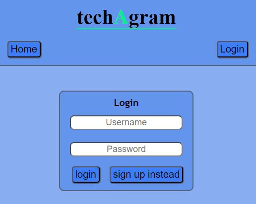
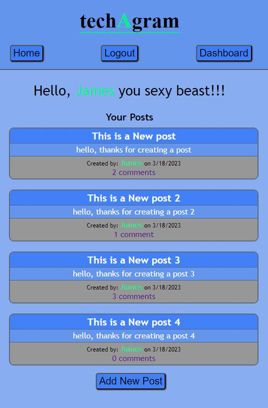
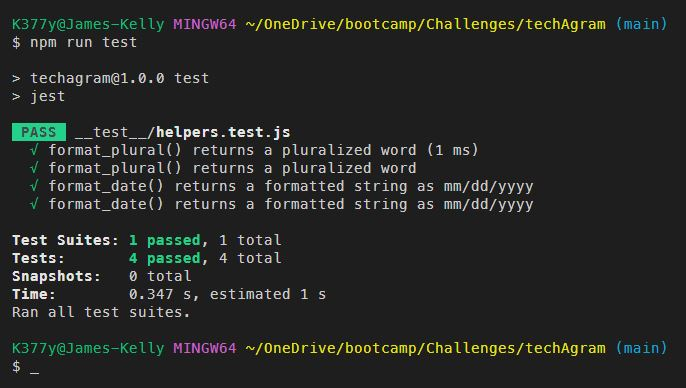

# ***techAgram***

 

## **Description**
Your challenge this week is to build a CMS-style blog site similar to a Wordpress site, where developers can publish their blog posts and comment on other developers’ posts as well. You’ll build this site completely from scratch and deploy it to Heroku. Your app will follow the MVC paradigm in its architectural structure, using Handlebars.js as the templating language, Sequelize as the ORM, and the express-session npm package for authentication.
 

## Table of Contents
- [Installation](#installation)
- [Usage](#usage)
- [Testing](#testing)
- [Technologies Used](#technologies-used)
- [Questions](#questions)
- [Contributing](#contributing)
- [License](#license)
 

## Installation
You must have node.js installed on your system. 
You must install all of the npm packages listed below. 
The packages must also be imported into the project. 
&emsp;***Dependencies:***
     &emsp;1) BCRYPT
     &emsp;2) CONNECT-SESSION-SEQUELIZE
     &emsp;3) DOTENV
     &emsp;4) EXPRESS
     &emsp;5) EXPRESS-HANDLEBARS
     &emsp;6) EXPRESS-SESSION
     &emsp;7) MYSQL2
     &emsp;8) PATH
     &emsp;9) SEQUELIZE 
&emsp;***Dev Dependencies:***
     &emsp;10) JEST
     &emsp;11) NODEMON
 

## Usage
Try me out @ https://techagram.herokuapp.com/
 
Repository @ https://github.com/jk377y/techAgram
 

1) Get started at the live link above. From the homepage you can see any posts which have been previously made.  To add a new post you will be redirected to login. 
 

2) Create an account and/or login. 

 

3) Once logged in you can create a new post from the dashboard or the hompage. 
 

4) Once you have created a post you can view it on the homepage or the dashboard. From the dashboard you can edit you posts, comments and delete them also. 

## Testing
Testing is done using Jest. I have designed tests to run on the helper functions that are being used. The format_plural() formats the plural form of comment(s) as needed when displaying how many comments have been added to a post (see image above of dashboard). The format_date() formats the date object into a string in the format of mm/dd/yyyy. To run the tests, mimic the following command in the console:
 

## Technologies Used
- Bcrypt @ https://www.npmjs.com/package/bcrypt
- Connect-Session-Sequelize @ https://www.npmjs.com/package/connect-session-sequelize
- Dotenv @ https://www.npmjs.com/package/dotenv
- Express.js @ https://www.npmjs.com/package/express
- Express-Handlebars @ https://www.npmjs.com/package/express-handlebars
- Express-Session @ https://www.npmjs.com/package/express-session
- Handlebars.js @ https://handlebarsjs.com/
- Heroku @ https://www.heroku.com/ (for deployment)
- Jest @ https://www.npmjs.com/package/jest
- Mysql2 @ https://www.npmjs.com/package/mysql2
- Node.js @ https://nodejs.org/en/ (for runtime environment)
- Nodemon @ https://www.npmjs.com/package/nodemon
- Path @ https://www.npmjs.com/package/path
- Sequelize @ https://www.npmjs.com/package/sequelize
 

## Questions
For Questions, I can be reached at the following:
 GitHub:  <a href ="https://github.com/jk377y" target="_blank">@ JK377y</a>
 OR
 Email:  jk377y@gmail.com
 

## Contributing
You also can help support me by donating with 💵Cash App💵 @ 💵$JK377Y💵
 

## License

 Copyright (c) 2023 James Kelly
 Information on this license can be found at: (https://opensource.org/licenses/MIT)